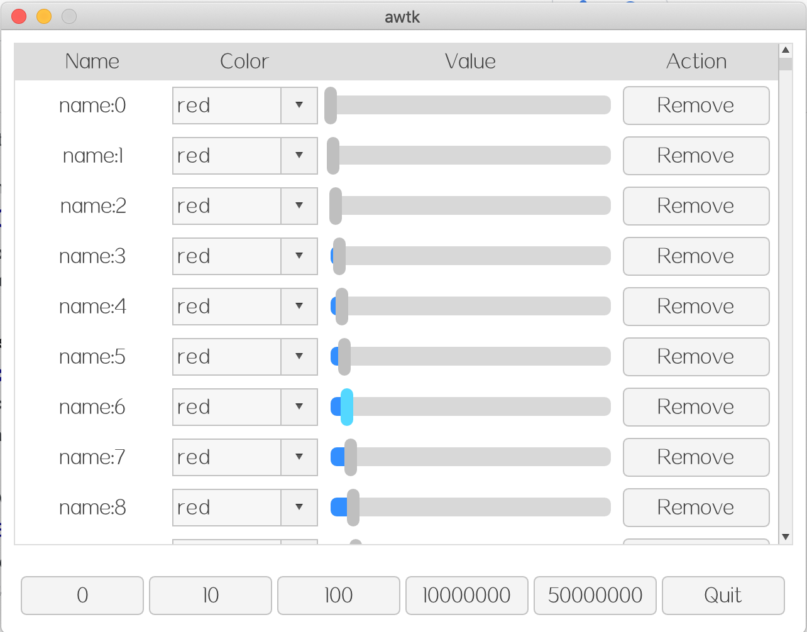

# awtk-widget-table_view

AWTK 的 ListView 是一个非常强大的控件，在列表项目中可以放比如文本、图片、编辑器、进度条、滑块和下拉框等各种控件。

但是 ListView 最大的问题是，每个列表项都必须事先创建好，这就导致 ListView 显示大量数据时，存在下列问题：

* 加载速度慢。
* 比较耗内存。

所以 ListView 在 PC 可以用于显示少于 10K 的数据，而在嵌入式平台上，只能用于显示少于 500 条记录的数据。

TableView 控件就是为了解决 ListView 控件的不足，具有如下特点：

* 列表项无需事先创建。
* 数据无需全部加载到内存。
* 轻松支持数千万条数据记录。
* 表格中可以放文本、图片、编辑器、进度条、滑块和下拉框等各种控件。

> 目前使用 32 位数据表示虚拟高度，最大记录数限制为 5000 万条记录。



## 准备

1. 获取 awtk 并编译

```
git clone https://github.com/zlgopen/awtk.git
cd awtk; scons; cd -
```

## 运行

1. 生成示例代码的资源

```
python scripts/update_res.py all
```
> 也可以使用 Designer 打开项目，之后点击 “打包” 按钮进行生成
> 如果资源发生修改，则需要重新生成资源。


2. 编译

```
Usage: scons SHARED[true|false] IDL_DEF[true|false] LCD[800_480|...]
Example:
scons
scons SHARED=false
scons IDL_DEF=false
scons LCD=480_272
scons SHARED=false IDL_DEF=false LCD=480_272
```
参数 SHARED 是可选的，用于指定是否编译生成动态库，缺省为true。
参数 IDL_DEF 是可选的，用于指定编译前是否重新生成idl.json和def文件，缺省为true。
参数 LCD 是可选的，用于指定示例程序运行时的LCD尺寸，格式为“height_width”。
> 注意：编译前先确定SConstruct 文件中的 awtk_root 为 awtk 所在目录，否则会编译失败。

3. 运行

* 基本示例

```
./bin/demo
```

* csv 文件查看和编辑

```
./bin/csv_view
```

## 文档

* [表格视图的基本用法](docs/usage.md)

* [完善自定义控件](https://github.com/zlgopen/awtk-widget-generator/blob/master/docs/improve_generated_widget.md)
