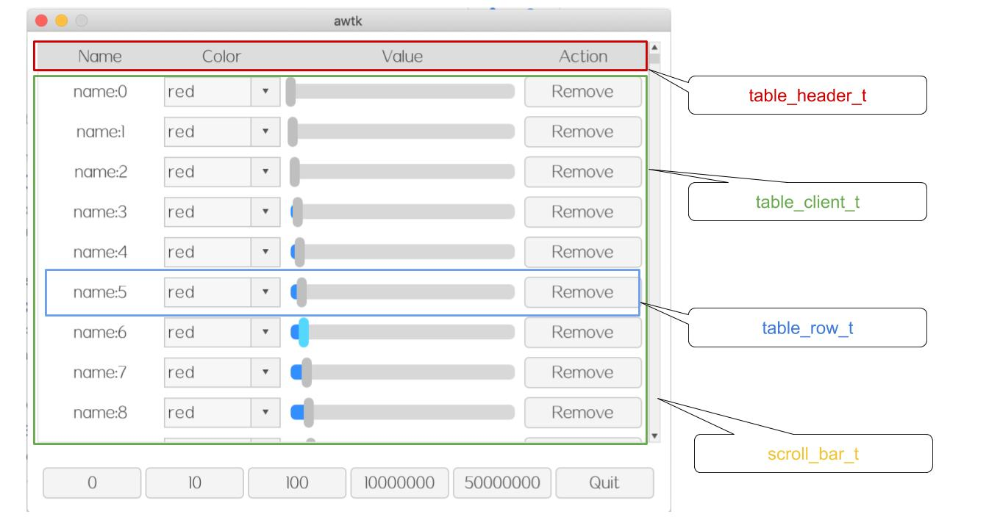

# awtk-widget-table-view

AWTK 的 ListView 是一个非常强大的控件，在列表项目中可以放比如文本、图片、编辑器、进度条、滑块和下拉框等各种控件。

但是 ListView 最大的问题是，每个列表项都必须事先创建好，这就导致 ListView 显示大量数据时，存在下列问题：

* 加载速度慢。
* 比较耗内存。

所以 ListView 在 PC 可以用于显示少于 10K 的数据，而在嵌入式平台上，只能用于显示少于 500 条记录的数据。

TableView 控件就是为了解决 ListView 控件的不足，具有如下特点：

* 列表项无需事先创建。
* 数据无需全部加载到内存。
* 轻松支持数千万条数据记录。
* 表格中可以放文本、图片、编辑器、进度条、滑块和下拉框等各种控件。

> 目前使用 32 位数据表示虚拟高度，最大记录数限制为 5000 万条记录。


## 准备

1. 获取 awtk 并编译

```
git clone https://github.com/zlgopen/awtk.git
cd awtk; scons; cd -
```

## 运行

1. 生成示例代码的资源

```
python scripts/update_res.py all
```
> 也可以使用 Designer 打开项目，之后点击 “打包” 按钮进行生成；
> 如果资源发生修改，则需要重新生成资源。

如果 PIL 没有安装，执行上述脚本可能会出现如下错误：
```cmd
Traceback (most recent call last):
...
ModuleNotFoundError: No module named 'PIL'
```
请用 pip 安装：
```cmd
pip install Pillow
```

2. 编译

```
scons
```

> 完整编译选项请参考[编译选项](https://github.com/zlgopen/awtk-widget-generator/blob/master/docs/build_options.md)

3. 运行

* 基本示例

```
./bin/demo
```

* csv 文件查看和编辑

```
./bin/csv_view
```

## 如何使用 table_view

### 使用 xml 创建 table_view



table\_view 由 table\_header（可选）、table\_client 和 scroll\_bar 组成。

* table\_view\_t 是表格视图的外壳，它的主要功能是协调 table\_client\_t 和滚动条。

* table\_header\_t 是表格的标题，它其实只是一个普通的容器，完全可以用 view 代替，但用 table\_header\_t 更具可读性。

* table\_client\_t 是表格的数据区，它是一个 table\_row\_t 的容器。

* table\_row\_t 表示表格中的一行，它只是个容器，里面可以文本、图片、编辑器、进度条、滑块和下拉框等各种控件。

在 table\_client 中，只需要写一个 table\_row，这个 table\_row 只是作为模版，由 table\_client 根据需要创建。

示例：

```xml
<table_view x="10" y="10" w="-20" h="-80">
  <table_header x="0"  y="0" w="-12" h="30" name="title" children_layout="default(r=1,c=0,s=5,m=5)">
    <label w="20%" text="Name" />
    <label w="20%" text="Color"/>
    <label w="40%" text="Value" />
    <label w="20%" text="Action" />
  </table_header>

  <table_client name="table_client" x="0"  y="30" w="-12" h="-30" row_height="40">
    <table_row children_layout="default(r=1,c=0,s=5,m=5)">
      <label name="name"  w="20%" h="100%" text="name" />
      <combo_box name="color" readonly="true" w="20%" h="80%" options="red;green;blue"/>
      <slider name="value" w="40%" h="80%" />
      <button name="remove" w="20%" h="80%" text="Remove" />
    </table_row>
  </table_client>
  <scroll_bar_d name="vbar" x="right" y="0" w="12" h="100%" value="0"/>
</table_view>
```

### 编写准备数据的回调函数

table\_client 不需要预先创建全部的 table\_row，而是在需要时调用回调函数，去填充指定行的数据。以当前的行号和 table\_row 对象为参数，实现者在回调函数中，加载当前行的数据，然后设置到 row 的子控件中。

```c
/**
 * @method table_client_set_on_load_data
 * 设置 加载数据的回调函数。
 * @param {widget_t*} widget widget 对象。
 * @param {table_client_on_load_data_t} on_load_data 回调函数。
 * @param {void*} ctx 回调函数的上下文。 
 *
 * @return {ret_t} 返回 RET_OK 表示成功，否则表示失败。
 */
ret_t table_client_set_on_load_data(widget_t* widget, table_client_on_load_data_t on_load_data,
                                    void* ctx);
/* 示例 */
static ret_t on_load_data(void* ctx, uint32_t index, widget_t* row) {
  char name[32];
  tk_snprintf(name, sizeof(name), "name:%u", index);

  widget_set_text_utf8(widget_lookup(row, "name", TRUE), name);
  widget_set_value(widget_lookup(row, "value", TRUE),index%100);
  widget_set_value(widget_lookup(row, "color", TRUE), 0);

  return RET_OK;
}

...
  table_client_set_on_load_data(client, on_load_data, client);
...

```

> 在本回调函数中，还可以调整控件的大小，设置控件的 style。

table_client 控件的属性名及作用如下表所示：

| 属性名       | 作用              |
| ------------ | ----------------- |
| row_height   | 行高              |
| rows         | 最大行数          |
| yoffset      | 偏移量            |
| yslidable    | 是否允许y方向滑动 |
| yspeed_scale | y方向偏移速度比例 |

table_client 控件其他特殊函数如下所示，以下两个函数所注册的回调函数执行时机分别是 table\_row 创建完成后，与 table\_row 创建前，用户可以在创建前后对数据进行预处理或者编辑操作：

```c
typedef ret_t (*table_client_on_create_row_t)(void* ctx, uint32_t row_index, widget_t* row);
/**
 * @method table_client_set_on_create_row
 * 设置 创建行时的回调函数，在回调函数中可以注册控件的事件。
 * @param {widget_t*} widget widget对象。
 * @param {table_client_on_create_row_t} on_create_row 回调函数。
 * @param {void*} ctx 回调函数的上下文。 
 *
 * @return {ret_t} 返回RET_OK表示成功，否则表示失败。
 */
ret_t table_client_set_on_create_row(widget_t* widget, table_client_on_create_row_t on_create_row,
                                     void* ctx);

typedef ret_t (*table_client_on_prepare_row_t)(void* ctx, widget_t* client, uint32_t prepare_cnt);
/**
 * @method table_client_set_on_prepare_row
 * 设置 预处理行（创建行）的回调函数，在回调函数中可以创建行控件。
 * @param {widget_t*} widget widget对象。
 * @param {table_client_on_prepare_row_t} on_prepare_row 回调函数。
 * @param {void*} ctx 回调函数的上下文。 
 *
 * @return {ret_t} 返回RET_OK表示成功，否则表示失败。
 */
ret_t table_client_set_on_prepare_row(widget_t* widget,
                                      table_client_on_prepare_row_t on_prepare_row, void* ctx);
```

table_row 控件的属性名及作用如下表所示：

| 属性名 | 作用     |
| ------ | -------- |
| index  | 行的编号 |

可以通过 tabel_row 的 index 属性来定位当前位置，以便进行保存等操作。

## 文档

* [表格视图的具体用法](docs/usage.md)

* [完善自定义控件](https://github.com/zlgopen/awtk-widget-generator/blob/master/docs/improve_generated_widget.md)

